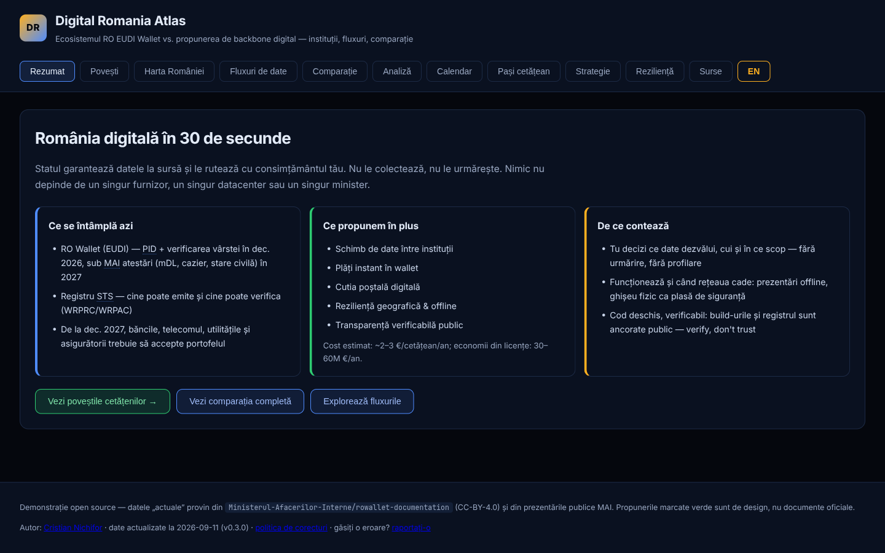
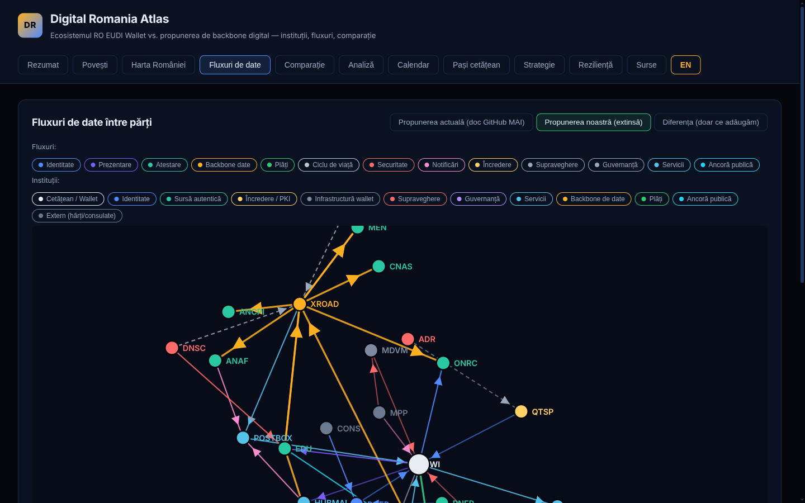
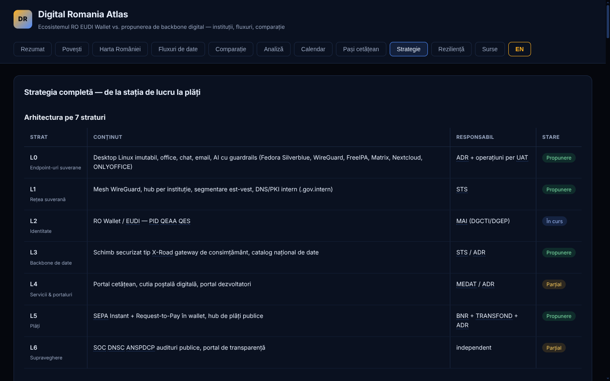
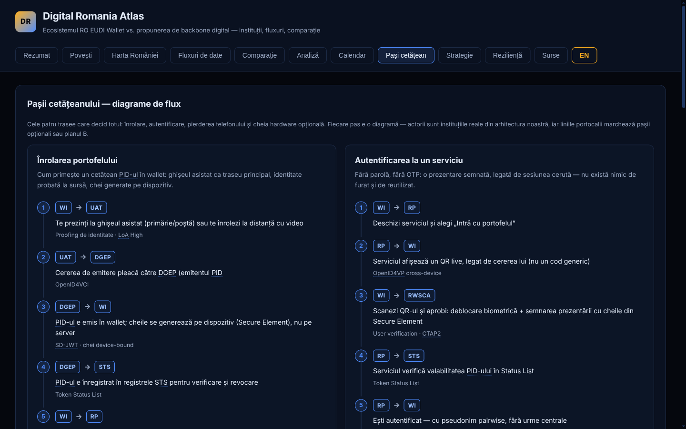

# Digital Romania Atlas

Interactive demo that maps the Romanian digital identity ecosystem and compares it with a
proposed "digital backbone" design: institutions plotted on a Romania map, force-directed
data-flow graphs between all parties, a side-by-side feature comparison, and a timeline.

**Live intent:** make the national EUDI Wallet plans (and the gaps) legible to developers,
journalists, and decision makers.

**Live demo:** https://cristiannichifor.github.io/digital-romania-atlas/ (RO/EN toggle in the
header)

**Author:** [Cristian Nichifor](mailto:cristian@cristian-nichifor.com) — see
[AUTHORS.md](AUTHORS.md) and [CITATION.cff](CITATION.cff).









## What it shows

| View                | Content                                                                                                                                                                                                                                                                                                                                                                                                                                                                                                |
| ------------------- | ------------------------------------------------------------------------------------------------------------------------------------------------------------------------------------------------------------------------------------------------------------------------------------------------------------------------------------------------------------------------------------------------------------------------------------------------------------------------------------------------------ |
| **Rezumat**         | "Romania digitală în 30 de secunde": what happens today, the 5 additions we propose, why it matters.                                                                                                                                                                                                                                                                                                                                                                                                   |
| **Povești**         | Thirteen citizen stories with personas — rural pensioner, proof of age, local tax, medical attestation, diaspora bank account, university enrolment, sick leave, car purchase, land book extract, civic verification, the lost phone, the anchored parliamentary vote, the company administrator — each showing today vs. proposal with the involved flow steps.                                                                                                                                       |
| **Harta României**  | County map with institutions as colored points (category-filterable). Small dots in every county = town halls (UAT) as assisted-enrollment / offline fallback points in the proposal.                                                                                                                                                                                                                                                                                                                  |
| **Fluxuri de date** | Three toggleable force-directed graphs. _"Propunerea actuală"_ reproduces only what the published MAI GitHub documentation describes (PID issuance, presentation, wallet backend, MDVM, RWSCA, push, status lists). _"Propunerea noastră"_ adds the data backbone, payments, digital postbox, diaspora, independent oversight, and public transparency anchors (permissionless chain + EBSI). _"Diferența"_ dims the documented flows and highlights only what the proposal adds. Filter by flow type. |
| **Comparație**      | 13-dimension table: published documentation vs. our proposal, with status (aligned / extended / added).                                                                                                                                                                                                                                                                                                                                                                                                |
| **Analiză**         | Policy brief: the verdict (honour the EUDI obligation, not the current architecture as end state), the 4 construction facts from the MAI presentation, the 8 risks (institutional concentration, vendor lock-in, surveillance capability, parallel identities, thin scope, unpublished resilience, per-institution integration, aggressive timeline) with fixes, the 8-criterion comparison, and the concrete gains.                                                                                   |
| **Calendar**        | EU obligations, the national plan, and our proposed additions side by side.                                                                                                                                                                                                                                                                                                                                                                                                                            |
| **Pași cetățean**   | Eight citizen-journey flow diagrams with numbered steps: wallet enrollment, signing in, the lost phone, the optional hardware key, the open and the secret parliamentary vote, the company mandate and delegation — every actor chip shows its full name and role on hover.                                                                                                                                                                                                                            |
| **Strategie**       | Full 7-layer architecture (L0 sovereign endpoints → L6 oversight), the six pillars (redundancy, open source, security, scalability, transparency anchors, educational & civic networks), redundancy tiers per service class, 5-year cost estimates, machines & equipment required, estimated savings, the 14 outward-facing portals, and the rationalisation of today's real state portals (inventory, consolidation map, governance rules, cutover phases).                                           |
| **Reziliență**      | The 3+8+1+L0 model: three semi-active sovereign sites, eight regional micro-DCs with own power generation (one per development region), an underground salt-mine vault, and offline L0 nodes; energy-autonomy math per tier; Vrancea/flood/outage/cable/cyber scenarios; hardware independence (OCP, open ISA, OpenBMC); software independence; RoEduNet/academia integration; 3-2-1-1-0 backup rules; resilience costs.                                                                               |
| **Surse**           | Provenance for every claim: MAI docs pinned at a specific commit, the MAI presentation, EU regulations, standards, the sovereign-OS article, and the verified state portals behind the rationalisation inventory.                                                                                                                                                                                                                                                                                      |

## Data sources

The "current" model is grounded in public sources:

- [Ministerul-Afacerilor-Interne/rowallet-documentation](https://github.com/Ministerul-Afacerilor-Interne/rowallet-documentation)
  (CC-BY-4.0) — roles (PID Provider = DGEP, Wallet Provider = DGCTI), components (WB, MDVM,
  RWSCA/RWSCD, MQ, PNS), EUDI Reference Implementation, OpenID4VC/SD-JWT/ISO mdoc.
- MAI presentation _„Portofelul European de Identitate Digitală — Rolul MAI în ecosistemul
  național"_ (July 2026): RO EUDIW Commission, STS registry (WRPRC/WRPAC), PuB-EAA portfolio,
  Phase 1 (Dec 2026, PID + age) / Phase 2 (2027), mandatory RP acceptance (Dec 2027).

The "proposed" model encodes the design discussed in this project: X-Road-style national data
backbone, SEPA Instant + Request-to-Pay in the wallet, digital postbox, geo-redundant
active-active infrastructure, pairwise pseudonyms, open-source mandate (EUPL), and independent
oversight (DNSC, ANSPDCP).

## For public debate

- **Cite with version + date.** The footer shows `v0.2.0, data as of 2026-09-11`; cite both
  (`src/data/meta.ts`).
- **Deterministic UAT figures.** Share a `?scenario=249` URL to pin the unit count — everyone
  opening the link sees the same numbers (see
  [docs/METHODOLOGY.md](docs/METHODOLOGY.md) for the three scenario modes).
- **Corrections policy.** Factual errors are fixed fast and logged publicly in
  [ERRATA.md](ERRATA.md); file one via the `correction` issue template. Disagreement with the
  proposal goes to the steelman section (Analiză view) or a `design discussion` issue.
- **Methodology.** [docs/METHODOLOGY.md](docs/METHODOLOGY.md) states what every figure claims:
  cost numbers are design estimates (bands, with named precedents), never budgets.
- **Press kit.** The Sources view exports the full data as JSON or CSV for journalists.
- **Archival.** Cite by version string; the repo is archived by Software Heritage
  (`archive.softwareheritage.org`). Release tags match the footer version.

## Run it

```bash
npm install
npm run dev
```

Build: `npm run build` (type-checks and produces `dist/`). Fully client-side; the only fetched
asset is the bundled county GeoJSON in `public/data/`.

## Where the data lives

Everything is plain typed data — edit without touching components:

- `src/data/institutions.ts` — nodes: name, role, category, county, coordinates, scope
  (`current` | `proposed` | `both`)
- `src/data/flows.ts` — directed edges with kind (identity, presentation, payment, backbone…),
  label, protocol, status
- `src/data/comparison.ts` — the comparison table
- `src/data/timeline.ts` — the calendar
- `src/data/strategy.ts` — layers, pillars, costs, portals (Strategie tab)
- `src/data/hr.ts` — human resources: team templates, per-institution FTE, RO vs EU pay bands (Strategie tab)
- `src/data/resilience.ts` — DC placement, regional micro-DCs, underground sites, energy autonomy, disaster scenarios, hardware/software sovereignty, academia, costs (Reziliență tab)
- `src/data/policy.ts` — the policy brief: verdict, current-architecture facts, the 8 risks with fixes, criteria, gains (Analiză tab)
- `src/data/stories.ts` — the citizen stories
- `src/data/journeys.ts` — the step-by-step citizen journeys (Pași cetățean)
- `src/data/sources.ts` — provenance links for every claim
- `src/i18n.tsx` — RO/EN language context; every data field is `{ ro, en }`
- `public/data/ro-counties.geojson` — Romania counties (42 features, incl. București)

County GeoJSON source: [GabrielRondelli/geojson](https://github.com/GabrielRondelli/geojson)
(GADM-derived, `romania-counties.geojson`); community alternative:
[civicnet/geojson-romania](https://github.com/civicnet/geojson-romania).

## Civic standards

The project follows the [CivicTech România Digital Services Playbook](https://civictechro.github.io/playbook/)
and [Open Source Guidelines](https://civictechro.github.io/guidelines/): code in English,
Romanian content with diacritics, mandatory i18n (`{ ro, en }` on every data field),
`npm test` (data integrity) required in CI, licence files, and the community
[Code of Conduct](https://github.com/civicnet/code-of-conduct) (see `CODE_OF_CONDUCT.md` and
`CONTRIBUTING.md`).

## Security

See [SECURITY.md](SECURITY.md) for the reporting policy. The repository enforces in CI:

- every GitHub Action pinned to a full commit SHA;
- `npm audit --audit-level=high` as a build gate;
- CodeQL static analysis on every push and PR;
- OSV-Scanner on every push and PR;
- OSSF Scorecard weekly (results published on the Security tab);
- SLSA provenance attestation for the GitHub Pages artifact;
- least-privilege workflow permissions (`contents: read` by default);
- Dependabot: weekly npm + monthly Actions PRs, plus push protection and
  private vulnerability reporting enabled on the repository.

## Known limitations

- Coordinates for national institutions are approximate (Bucharest area) and manually spread
  for readability.
- The MAI documentation marks several chapters (cryptography, wallet backend details, PID
  issuance/presentation flows) as _"Planned update"_ — where it is silent, the comparison marks
  our side as "added", and the absence itself is the finding.
- Not affiliated with MAI or any institution; proposal content is design opinion, not policy.

## License

MIT (code and data authored here). The bundled county GeoJSON retains its upstream provenance.
